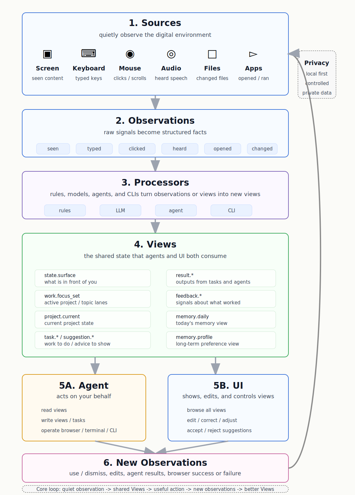

# Info

Info is a local-first, agent-native context runtime.
It turns raw observations into reusable Views, exposes them through CLI and HTTP, and lets agents act on the same state humans see.

The short version:

```text
Sources -> Observations -> Processors -> Views -> Agent/UI actions -> New Observations -> ...
```



## Core Loop

Info has one loop:

```text
Observation -> Processor -> View -> Action -> Observation
```

Everything useful becomes a View:

- current state is a View
- a suggestion is a View
- a task is a View
- a result is a View
- feedback is a View family
- memory is a View family

The point is simple: what a human can inspect, an agent should be able to inspect too. What a human can operate, an agent should be able to operate too.

## Current canonical Views

These are the main top-level View families today:

- `state.surface`
- `work.focus_set`
- `project.current`
- `memory.daily`
- `memory.profile`
- `task.*`
- `result.*`
- `feedback.*`

Use `pnpm mf --json state` and `pnpm mf --json view latest <view_type>` to inspect them.

## What the system can do today

- Read and write canonical Views
- Run processors and inspect processor output
- Route agent work through task Views
- Pull Screenpipe evidence through CLI
- Track daily markdown memory and user preference memory
- Expose Chrome ACP tools for current-tab read, observe, act, debugger, and task surfaces

## CLI

This is the main agent surface.

```bash
pnpm mf --json help
pnpm mf --json state
pnpm mf --json view list
pnpm mf --json view latest project.current
pnpm mf --json processor list
pnpm mf --json processor report
pnpm mf --json task list --refresh
pnpm mf --json task queue --limit 8
pnpm mf --json sensor screenpipe status
pnpm mf --json sensor screenpipe search --focused --app Cursor --start "30m ago"
pnpm mf --json memory daily show --date 2026-06-17
pnpm mf --json memory profile show
```

## Chrome ACP

`apps/chrome-acp/packages/chrome-extension/` is the current browser surface.
It gives the agent the same practical powers a user has in the active Chrome tab:

- read the current tab
- observe interactive elements
- act on a tab by intent or direct selector
- use current-tab debugger tools when needed
- query task Views and View state from the side panel

This is important because the browser is not just a display surface.
It is a source of evidence and an action surface.

Load it unpacked from:

```text
apps/chrome-acp/packages/chrome-extension/
```

## Memory

Memory is split into two editable View-backed files:

- `memory/daily/YYYY-MM-DD.md`
- `memory/profile/user.md`

`memory.daily` is for one-day summaries.
`memory.profile` is for durable preferences, style, and working patterns.

## Start here

```bash
pnpm install
pnpm run dev
```

HTTP runtime defaults to `http://localhost:3111`.

UI:

```bash
pnpm run ui:dev
pnpm run ui:build
```

## Design docs

- `docs/view-first-proactive-agent-os.md`
- `docs/info-design-consensus.md`
- `docs/agent-surface-cli.md`
- `docs/info-ambient-runtime-architecture.md`

## Status

This is a mature working system with a live CLI, View system, runtime processors, memory surfaces, and a Chrome ACP browser agent surface.
The implementation is still evolving, but the contract is no longer a sketch.
