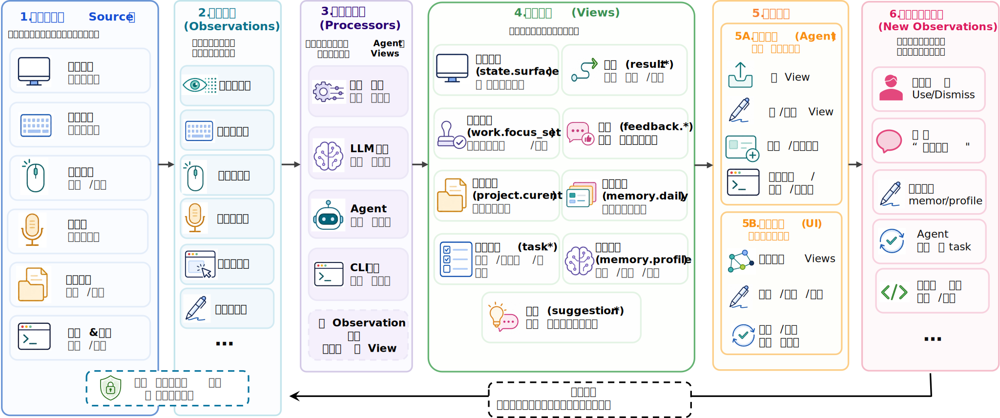
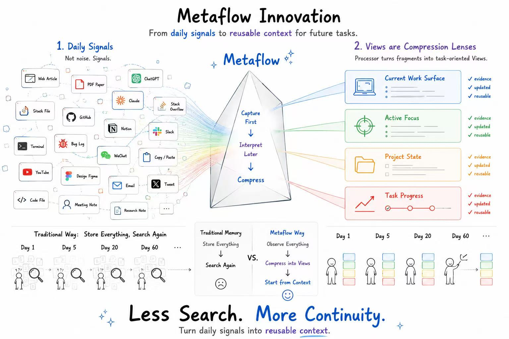

# Metaflow

<p align="center">
  <a href="./README.md">English</a>
</p>

Metaflow 是一个本地优先的个人 AI Agent 上下文运行时。它把对话、浏览器、项目、日志、Screenpipe 和用户反馈这些原始工作痕迹，转成有类型、可检查、可复用的 Views，让 Agent 和应用可以拥有真正能工作的长期上下文。

```text
观察 -> 处理器 -> ViewGraph -> 应用 / Agent 行动 -> 反馈 -> 演化
```





## 为什么需要 Metaflow

很多 memory 系统只是把历史存下来，然后希望检索能在未来找回正确片段。Metaflow 的观点更直接：memory 不应该只是过去的记录，而应该是一个会被任务、反馈和结果持续塑形的 ViewGraph。

一个好的 View 的价值，不是“它保存了很多东西”，而是它能减少下一次工作的搜索成本：更少 token、更少重复查找、更少上下文丢失、更少失败重来。

## 现在已经能做什么

- 从对话、浏览器活动、Screenpipe、项目文件、日志和运行时事件中捕获 observation。
- 写入 `state.surface`、`work.focus_set`、`project.current`、`task.*`、`result.*`、`feedback.*`、`memory.daily`、`memory.profile` 等 canonical Views。
- 运行 deterministic、LLM、脚本和 agent-task 类型的 processors。
- 维护 ViewGraph，支持 fork、update、archive、delete、trace 和 children 查询。
- 通过 `pnpm mf` 提供 Agent 可用的 CLI surface。
- 提供 HTTP runtime 和 React UI，用来查看 Views、processors、memory、proactive inbox 和项目状态。
- 提供 Chrome ACP 浏览器 surface，让 Agent 能读当前页面、观察元素、执行浏览器操作，并利用当前页面上下文。
- 提供 adaptive View promotion：让重复工作、有价值状态和反馈逐渐变成更好的 Views 或 processors。

## 架构

Metaflow 由七层组成：

| 层 | 作用 |
| --- | --- |
| Observation stream | 对话、浏览器状态、Screenpipe 证据、代码、日志、失败和用户反馈 |
| Task discovery | 发现重复工作、高成本搜索、未闭环任务、失败模式和可复用方法 |
| Processor runtime | 运行 deterministic code、LLM prompts、scripts、agent tasks 和 browser jobs |
| ViewGraph | 存储有类型、带来源和生命周期状态的任务相关 Views |
| Personal apps | 把 Views 投射成 dashboard、学习工具、memory inbox 和浏览器 surface |
| Verification | 衡量任务成功率、有用性、编辑、拒绝、延迟和搜索成本 |
| Evolution | 创建、更新、fork、merge、split、retire 和 promote Views / processors |

这里所有重要东西都应该能成为 View：当前状态是 View，任务是 View，结果是 View，反馈是一组 Views，memory 是一种会改变未来行为的 retained View。

## 仓库结构

```text
apps/
  chrome-acp/          Chrome ACP 浏览器 agent surface
  ui/                  React 检查界面
  mac-companion/       macOS companion app
packages/
  core/                Store、schema、生命周期、plugin registry、View 查询
  server/              HTTP runtime
  processor-runtime/   Processor registry 和执行运行时
  view-system/         Canonical View 定义和内置 Views
  views/               View catalogs、timelines、proactive 和 workflow Views
  runtime/             Ambient runtime loop
  sensors/             Screenpipe 和其它 observation sources
  capabilities/        Agent/runtime capability adapters
docs/                  架构、契约、设计说明和 issue 文档
criteria/              各工作流的验收标准
scripts/               CLI、runtime、ingest、timeline 和维护脚本
```

## 快速开始

环境要求：

- 支持 `--experimental-sqlite` 的 Node.js
- pnpm

安装依赖：

```bash
pnpm install
```

启动 HTTP runtime：

```bash
pnpm run dev
```

默认地址：

```text
http://localhost:3111
```

启动 UI：

```bash
pnpm run ui:dev
```

构建 UI：

```bash
pnpm run ui:build
```

运行测试：

```bash
pnpm test
```

类型检查：

```bash
pnpm run typecheck
```

## CLI

`pnpm mf` 是主要的 Agent 操作入口。

```bash
pnpm mf --json help
pnpm mf --json state
pnpm mf --json view list
pnpm mf --json view latest project.current
pnpm mf --json view children view:source
pnpm mf --json view fork view:source --id view:task --view-type task.browser_brief --patch ./patch.json
pnpm mf --json view update view:task --status accepted --patch ./patch.json
pnpm mf --json view delete view:task --reason "superseded"
pnpm mf --json processor list
pnpm mf --json processor report
pnpm mf --json processor run processor.view_promotion_engine --record obs:example
pnpm mf --json task list --refresh
pnpm mf --json task queue --limit 8
pnpm mf --json sensor screenpipe status
pnpm mf --json sensor screenpipe search --focused --app Cursor --start "30m ago"
pnpm mf --json memory daily show --date 2026-06-17
pnpm mf --json memory profile show
```

## 核心 View Families

- `state.surface`：用户当前正在看或正在操作的东西。
- `work.focus_set`：当前任务、窗口、项目和意图。
- `project.current`：当前项目状态和下一步有用行动。
- `task.*`：待处理、进行中、委托中和已完成的工作。
- `result.*`：任务或 Agent 行动的产出。
- `feedback.*`：接受、拒绝、编辑、纠正和有用性信号。
- `memory.daily`：当天的重要记忆。
- `memory.profile`：长期偏好、习惯和工作模式。
- `suggestion.*`：可能对用户有帮助的建议或行动。

## Chrome ACP

`apps/chrome-acp/packages/chrome-extension/` 是当前的浏览器 Agent surface。它让 Agent 能够：

- 读取当前标签页；
- 观察可交互元素；
- 按 intent 或 selector 执行操作；
- 必要时使用当前 tab 的 debugger 能力；
- 从 side panel 查询 task Views 和 View state。

以 unpacked extension 的方式加载：

```text
apps/chrome-acp/packages/chrome-extension/
```

## Personal Applications

应用不是单独的 memory 孤岛，而是同一个 ViewGraph 上的不同投影。

- 英语学习应用：语言输入、困难片段、复习队列和学习记忆。
- 研究应用：假设、证据、方法、失败、时间线和开放问题。
- 项目指挥中心：`project.current`、项目任务、agent task lists 和自动化结果。
- Memory inbox：memory candidates、daily memory、profile memory 和 feedback。
- 浏览器任务 cockpit：当前页面状态、browser task Views、Chrome ACP 结果和操作结果。
- Workflow miner：traces、重复任务簇、失败模式和成功方法。

## 关键文档

- [Adaptive ViewGraph Memory](docs/adaptive-viewgraph-memory.md)
- [View-First Proactive Agent OS](docs/view-first-proactive-agent-os.md)
- [Application Surface Contract](docs/application-surface-contract.md)
- [Evolution Engine](docs/evolution-engine.md)
- [Info Design Consensus](docs/info-design-consensus.md)
- [Agent Surface CLI](docs/agent-surface-cli.md)
- [Ambient Runtime Architecture](docs/info-ambient-runtime-architecture.md)
- [View Implementation Matrix](docs/view-implementation-matrix.md)

## 当前状态

Metaflow 已经是一个能运行的本地优先系统：有 CLI、ViewGraph、runtime processors、memory surfaces、React UI 和 Chrome ACP 浏览器 Agent surface。实现还在快速演进，但核心契约已经清楚：

```text
让上下文可检查，让记忆可行动，让反馈推动系统变聪明
```
